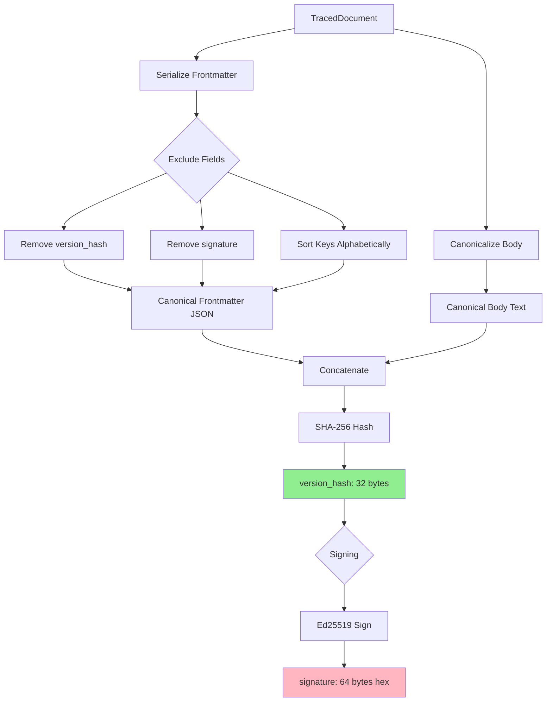

This document is the technical backbone of your project. It needs to explain **how** the system works to a developer who has never seen it before, translating your vision of "elegance" and "simplicity" into concrete engineering decisions.


# Architecture: The Trace Protocol

## 1. High-Level Overview

**Trace** is a protocol and library designed to act as the "Chain of Custody" for knowledge work. It addresses the crisis of information pollution in the age of AI by enforcing:
1.  **Cryptographic Provenance:** Every piece of information is signed.
2.  **Agentic Distinction:** Explicit differentiation between Biological (Human) and Synthetic (AI) authorship.
3.  **Immutable Lineage:** A Git-like history for research data, ensuring that reasoning is never circular.

The system is architected as a **Monorepo** with a centralized **Rust Core** that powers various downstream language bindings (Python, Wasm, Go).


---

## 2. Core Design Principles

### 2.1 Storage Agnosticism
Trace is a **Data Format**, not a database.
* A Trace document can be stored on a local disk, an AWS S3 bucket, a Postgres database, or IPFS.
* The validity of the document is intrinsic to the file itself (via hashing and signatures), not the system storing it.

### 2.2 The "Envelope" Data Model
To satisfy the requirement of separating **Form** (Metadata) from **Content** (Research), we use an Envelope pattern.

* **The Header (Cleartext):** Contains the ID, Version Hash, Authorship, and Citation Links. This is always readable to allow indexing and graph building.
* **The Payload (Optional Ciphertext):** Contains the actual intellectual property. This can be encrypted.


### 2.3 The Merkle DAG (Directed Acyclic Graph)
Trace enforces a strict time-arrow.
* **Backward References Only:** A document can only cite documents that existed *before* it was created.
* **Immutable References:** Citations point to a specific `Version Hash`, not a dynamic URL. If the source document changes, the citation remains pointing to the *original* context used for the deduction.

---

## 3. System Components

The repository is organized to prioritize a "Single Source of Truth" for the protocol logic.

### 3.1 Layer 1: The Core (`/core-rust`)
* **Language:** Rust (2021 Edition)
* **Responsibilities:**
    * **Serialization:** Deterministic JSON handling (canonicalization).
    * **Hashing:** SHA-256 implementation for content addressing.
    * **Signing:** Ed25519 implementation for identity verification.
    * **Encryption:** ChaCha20-Poly1305 for payload sealing.
* **Why Rust?** It guarantees memory safety and prevents "logic drift." We write the verification logic once, and it behaves identically across all platforms.

### 3.2 Layer 2: The Bindings (`/bindings`)
This layer exposes the Rust core to other ecosystems via FFI (Foreign Function Interface).

* **Python Binding (`/bindings/python`):**
    * Uses `PyO3`.
    * **Use Case:** Data Science, ML Pipelines, Jupyter Notebooks.
    * *Example:* An AI Agent running in Python imports `trace` to sign its output.
* **WASM Binding (`/bindings/wasm`):**
    * Uses `wasm-bindgen`.
    * **Use Case:** Browser-based text editors, React/Vue dashboards.
    * *Example:* A journalist validates a source directly in their browser without a backend.
* **Go/C Binding (Future):**
    * Uses standard C-ABI.
    * **Use Case:** High-performance CLI tools, Server backends.

### 3.3 Layer 3: The Identity & Key Management
Trace does not manage a central user database. It relies on **Key Pairs**.
* **Private Key:** Held by the Author (Human or Agent). Used to sign updates.
* **Public Key:** Stored in the Document Header. Used by readers to verify authenticity.
* **Agent Identity:** The protocol includes specific metadata fields to identify the *Model* (e.g., "GPT-4o") and the *System Prompt Hash* used to generate the content.

---

## 4. Data Flow Lifecycle

### Stage 1: Ingestion (Input)
Raw Markdown data is ingested.
1.  **Parsing:** The document is split into Frontmatter (YAML) and Body (Markdown).
2.  **Section Detection:** The body is parsed to identify `trace` and `include` blocks.

### Stage 2: Sealing (Processing)
The Author (Human or Agent) "Seals" the document using the `seal()` method.

#### 2.1 Canonicalization
To ensure deterministic hashing across platforms:
1.  **Line Ending Normalization:** All content is converted to Unix-style line endings (`\n`).
2.  **Whitespace Stripping:** Trailing whitespace is removed from each line.
3.  **YAML Key Ordering:** Frontmatter fields are serialized in alphabetical order.
4.  **UTF-8 Encoding:** All text is treated as UTF-8.

#### 2.2 Hashing
1.  **Status Update:** Document status is set to `Published` and `modified_at` timestamp is updated.
2.  **Frontmatter Serialization:** Create a JSON representation of frontmatter fields (excluding `version_hash` and `signature`), sorted alphabetically.
3.  **Body Canonicalization:** Apply line-ending normalization and whitespace stripping to the body.
4.  **Hash Computation:** `version_hash = SHA256(canonical_frontmatter_json + canonical_body)`

#### 2.3 Signing
1.  **Ed25519 Signature:** The `version_hash` (32 bytes) is signed using the author's private key.
2.  **Signature Storage:** The resulting signature (64 bytes) is stored as hex in the `signature` field.

### Stage 3: Verification (Output)
A consumer reads the document and calls `verify(public_key)`.
1.  **Integrity Check:** Re-calculates the `version_hash` from the current content and compares it to the stored value.
2.  **Authenticity Check:** Uses the provided `public_key` to verify the `signature` against the stored `version_hash`.
3.  **Result:** Returns `Ok(())` if both checks pass, or an error describing the failure.

---

## 4.5 Canonicalization and Hashing Strategy

To ensure deterministic verification across different platforms and editors, the Trace Protocol implements strict canonicalization rules.

### Canonicalization Rules

1. **Line Ending Normalization:** All content is normalized to Unix-style line endings (`\n`).
2. **Whitespace Stripping:** Trailing whitespace is removed from each line.
3. **YAML Key Ordering:** Frontmatter keys are sorted alphabetically before hashing.
4. **UTF-8 Encoding:** All text is treated as UTF-8.

### Hashing Process (Diagram)



### What is Hashed

**Included in Hash:**
- Document ID (UUID v7)
- Title
- Author
- Created timestamp
- Modified timestamp (if present)
- Document status
- Extra metadata (if present)
- Entire canonicalized body

**Excluded from Hash:**
- `version_hash` (self-referential)
- `signature` (computed from hash)

### Example

**Original Document:**
```yaml
---
title: "Test Report"  
id: 019d1234-5678-7890-abcd-ef1234567890
author: "Alice"    
created_at: 2025-12-27T10:00:00Z
---
This is the body.   
```

**Canonicalized for Hashing:**
```json
{"author":"Alice","created_at":"2025-12-27T10:00:00Z","doc_status":"notes","id":"019d1234-5678-7890-abcd-ef1234567890","title":"Test Report"}
This is the body.
```

**Result:**
- `version_hash`: `sha256:a1b2c3d4...`
- `signature`: Ed25519 signature of `version_hash`

---

## 5. Security & Cryptography Standards

To ensure longevity and trust, we use standard, non-proprietary algorithms.

| Component | Algorithm | Purpose |
| :--- | :--- | :--- |
| **Identity** | Ed25519 | Digital Signatures (Fast, secure, small keys). |
| **Integrity** | SHA-256 | Hashing content to create IDs. |
| **Privacy** | ChaCha20-Poly1305 | Symmetric encryption for the payload (Optional). |
| **Serialization** | JSON (Canonical) | Ensures the hash is the same regardless of whitespace. |

---

## 6. Future Considerations (Roadmap)

1.  **Protocol Versioning:** Adding a `protocol_version` field to the frontmatter to handle future breaking changes in canonicalization or hashing algorithms. This would allow the verifier to use the appropriate canonicalization rules for each document version.
2.  **Semantic Hashing:** Moving beyond exact string matching to allow citation of "ideas" rather than just "bytes" (Vector Embeddings).
3.  **Diff-Syncing:** Allowing two users to edit a Trace document simultaneously (CRDTs) while maintaining the signature chain.

---

### Key Decision: Why a Monorepo?
We chose a Monorepo structure to ensure that **Protocol Changes** are atomic. If we update the Hashing Algorithm in the Spec, the Rust Core, Python Bindings, and CLI tools are updated in the same Pull Request. This prevents the ecosystem from fragmenting into incompatible versions.